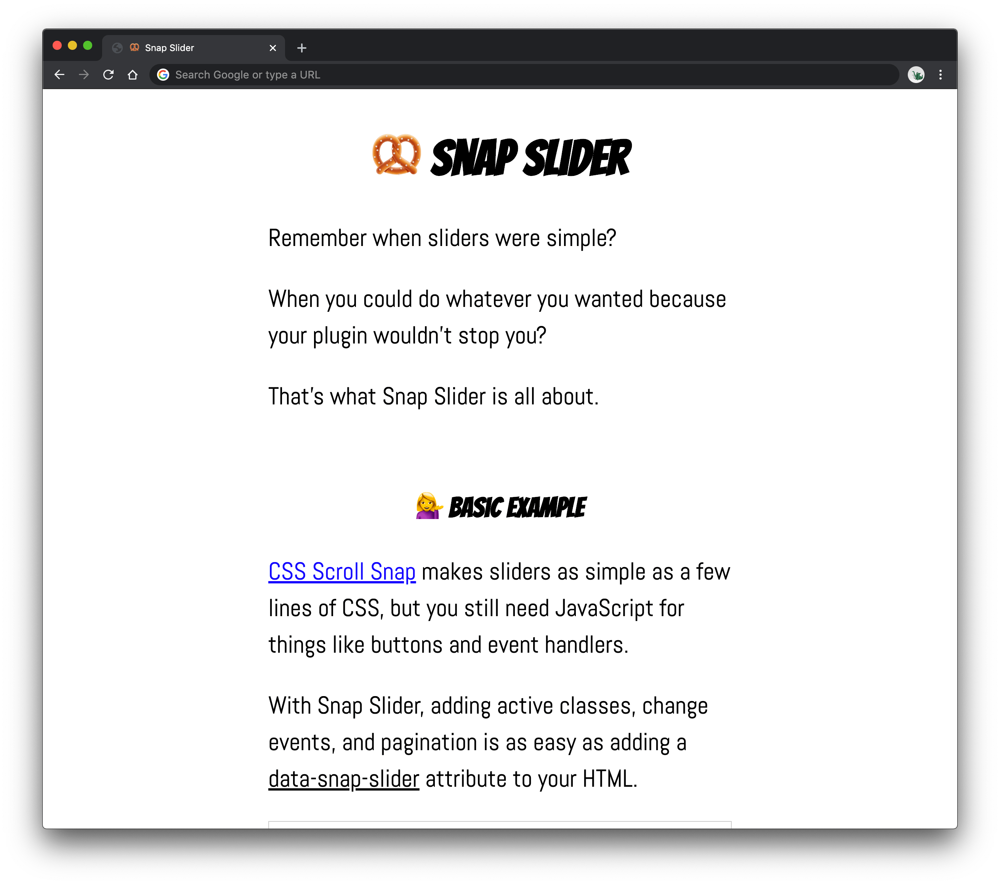

# Snap Slider

Simple JavaScript plugin to manage sliders using [CSS Scroll Snap](https://developer.mozilla.org/en-US/docs/Web/CSS/CSS_Scroll_Snap).

## ⚡️ Quick Start

1. `npm install --save @tannerhodges/snap-slider`
2. `import SnapSlider from '@tannerhodges/snap-slider';` _-- OR --_ `<script async src="snap-slider.min.js"></script>`
3. Add `data-snap-slider` to your elements.

---

## 📖 Outline

- [Why?](#-why)
- [Install](#%EF%B8%8F-install)
- [HTML API](#-html-api)
- [JavaScript API](#-javascript-api)
- [CodePen Examples](#%EF%B8%8F-codepen-examples)
- [Changelog](#-changelog)

## 🤔 Why?

[CSS Scroll Snap](https://caniuse.com/#feat=css-snappoints) makes sliders as simple as a few lines of CSS, but you still need JavaScript for things like buttons and event handlers.

Snap Slider makes that as easy as adding a `data-snap-slider` attribute.

👉 For a full explanation & demos, [check out the docs](https://tannerhodges.github.io/snap-slider/).

[](https://tannerhodges.github.io/snap-slider/)

## ⚙️ Install

1. Install the package.

```bash
npm install @tannerhodges/snap-slider
```

2. Import the package into your application script.

```js
import SnapSlider from '@tannerhodges/snap-slider';
```

Or, if you prefer, include the script in your HTML.

```html
<script async src="snap-slider.min.js"></script>
```

## 👨‍🏫 HTML API

### Elements

- `data-snap-slider="<ID>"` - **Container**. Create a slider for this container element. Should have CSS `position: relative`, `overflow: scroll`, and `scroll-snap-type` defined.
- `data-snap-slider-nav="<ID>"` - **Nav**. Wrap around a group of buttons to specify which slider they control.
- `data-snap-slider-goto="<SLIDE>"` - **"Goto" Button**. Tell a button which slide it should go to. (Can target specific sliders using `<ID>:<SLIDE>` syntax.)
    - Possible values: Numbers (starting at 1), `first`, `middle`, `last`, `prev`, `next`.

### Options

- `data-snap-slider-slides` - By default, Snap Slider assumes all the container's children are slides. If you have non-slide elements in your slider, add this attribute to the container to specify which elements should be treated as slides.
- `data-snap-slider-align="<ALIGN>"` - Snap Slider checks each slide's CSS `scroll-snap-align` to calculate its scroll position, but older browsers fail to return this value. If you need to support `center` or `end` alignments in Internet Explorer, add this attribute to a container or slide to specify its alignment.
    - Possible values: `start`, `end`, or `center`.
- `data-snap-slider-start="<SLIDE>"` - Sliders start on slide 1 by default. Add this attribute to a container to specify a different slide to start on.
    - Possible values: Numbers (starting at 1), `first`, `middle`, `last`.
- `data-snap-slider-loop="<BOOLEAN>"` - Previous/next buttons are disabled on the first/last slides by default. Add this attribute to a container to enable them to loop around to the other end of the slider (e.g., clicking a previous button on slide 1 will goto the last slide).
- `data-snap-slider-buttons="<SELECTOR>"` - Snap Slider automatically inits `button`s in nav elements as goto buttons. Add this attribute to a container or nav to specify which elements should be treated as goto buttons.
- `data-snap-slider-prev="<SELECTOR>"` - Snap Slider tries to detect previous buttons based on their content and class names (e.g., if the text or class contains the string "prev"). Add this attribute to a container or nav to target a custom selector for previous buttons.
- `data-snap-slider-next="<SELECTOR>"` - Snap Slider tries to detect next buttons based on their content and class names (e.g., if the text or class contains the string "next"). Add this attribute to a container or nav to target a custom selector for next buttons.

## 🤖 JavaScript API

### Constructor

```js
const slider = new SnapSlider(
  // `container` - This is the slider's container element.
  // You can pass in a string selector, Element, NodeList, or jQuery object.
  container,

  // `options` - This object extends the default settings.
  {
    // `options.id` - String ID for this slider.
    //   Use this to associate containers, navs, and goto buttons.
    //   If empty, defaults to `container.children`.
    id: '',

    // `options.slides` - String selector to target slide elements.
    //   Useful if you have non-slide elements in your container.
    //   If empty, defaults to `container.children`.
    slides: '',

    // `options.align` - String to specify fallback alignment for older browsers.
    //   Mimics `scroll-snap-align` for browsers that don't support CSS Scroll Snap.
    align: '',

    // `options.nav` - String selector to target nav elements.
    //   Looks for matches across the whole document.
    nav: '',

    // `options.buttons` - String selector to target goto buttons.
    //   Looks for matches in container and nav elements.
    buttons: '',

    // `options.prev` - String selector to target previous buttons.
    //   Looks for matches in container and nav elements.
    prev: '',

    // `options.next` - String selector to target next buttons.
    //   Looks for matches in container and nav elements.
    next: '',

    // `options.start` - Number or string alias to change which slide is current on load.
    //   Accepts any valid goto alias (numbers starting at 1, `first`, `middle`, `last`).
    start: 1,

    // `options.loop` - Boolean to enable prev/next buttons to loop around to the other end of the slider.
    loop: false,

    // `options.on` - Object to add callbacks for different events.
    on: {
      'load': () => {},
      'change': () => {},
      'change.click': () => {},
      'change.scroll': () => {},
      'change.keydown': () => {},
      'change.focusin': () => {},
      'scroll': () => {},
      'scroll.start': () => {},
      'scroll.end': () => {},
    },
  }
);
```

### Properties

- `align` - What's this slider's CSS `scroll-snap-align`?
- `callbacks` - Functions to fire for each slider event.
- `container` - Container element.
- `current` - Index of current slide. Values start at 1.
- `id` - Slider ID.
- `loop` - Boolean. Should slide loop or not?
- `options` - Slider options (default values + custom overrides).
- `scrolling` - Boolean. Is the slider scrolling at this moment?
- `slides` - Array of slides.
- `transition` - Object. Are we in the middle of a transition? Where from, to, etc.?

### Instance Methods

- `getSlide(index)` - Get a specific slide element. Accepts any valid goto alias.
- `getCurrentSlide()` - Get the current slide element.
- `goto(index, [options])` - Go to a slide.
    - **Goto Aliases** - Numbers (starting at 1), `first`, `middle`, `last`, `prev`, `next`.
    - `options.focus` - By default, we focus slides when you go to them (except for relative changes like `prev` and `next`). Use this option to disable the default focus handling.
    - `options.force` - Force-update the scroll position, even if we're already on the current slide.
    - `options.ignoreCallbacks` - Ignore custom callbacks for events.
    - `options.immediate` - Immediately update position without smooth scrolling.
- `addNav(containerOrOptions, [options])` - Add a nav element for the current slider. Automatically hooks up any nav buttons inside the nav.
    - `options.container` - The nav element. Defaults to `containerOrOptions`. Limits the query for `buttons`, `prev`, and `next` to be inside the nav container (instead of the whole document).
    - `options.buttons` - String selector to target goto buttons inside the nav container. If empty, defaults to `button`.
    - `options.prev` - String selector to target previous buttons inside the nav container.
    - `options.next` - String selector to target next buttons inside the nav container.
- `addGotoButtons(buttonsOrOptions, [options])` - Add goto buttons for the current slider.
    - `options.container` - A parent nav element. If set, limits the query for `buttons`, `prev`, and `next` to be inside the nav container (instead of the whole document).
    - `options.buttons` - String selector to target goto buttons. Defaults to `buttonsOrOptions`.
    - `options.prev` - String selector to target previous buttons.
    - `options.next` - String selector to target next buttons.
- `update()` - Update this slider (e.g., on resize). Basically just repositions the current slide.
- `reset()` - Reset this slider (e.g., after adding or removing a slide). Updates the slide elements, our internal `slides` array, and repositions the current slide.
- `destroy()` - Destroy this slider. Stop any active transitions, remove its event listeners, and delete it from our internal array of slider instances.
- `on(event, callback)` - Add callbacks to fire on specific events.
    - `change` - Fires any time the current slide changes.
    - `change.click` - Fires when a user clicks a goto button.
    - `change.scroll` - Fires when a user scrolls to another slide.
    - `change.keydown` - Fires when a user is focused inside the container and presses an arrow key to change the current slide (e.g., up, down, left, or right).
    - `change.focusin` - Fires when a slide gains focus.
        - **Note**: For keyboard accessibility, we automatically focus the target slide whenever a user clicks a non-relative goto button. In other words, if you goto any index besides `prev` or `next` we'll auto-focus that slide.

### Static Methods

- `SnapSlider.get(id)` - Get the `SnapSlider` object for a slider based on its ID.
- `SnapSlider.debug([idOrElements])` - `console.log` info about a slider, its nav, or goto buttons.

### HTML Properties

- `Element.SnapSlider` - After a slider is intialized, you can access its `SnapSlider` instance by getting the element's `SnapSlider` property. For example, `document.querySelector('.example').SnapSlider`.

### Example

```js
import SnapSlider from '@tannerhodges/snap-slider';

// Create a new slider.
const slider = new SnapSlider('.example', {
  id: 'example-slider',
  nav: '.example-nav',
  start: 'middle',
});

// The rest is up to you!
// 🏃‍♂️ Go make something!
```

## ✍️ CodePen Examples

_TODO: Examples_

## 📝 [Changelog](changelog.md)
